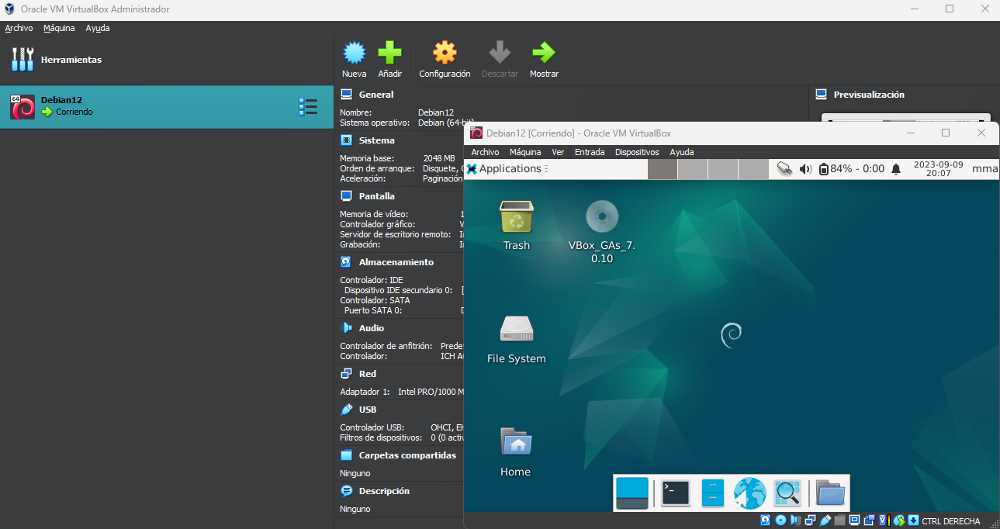

# SISTEMAS OPERATIVOS - PORTFOLIO
  
## Martín Martínez Arias - 27AV

**Tarea #998 :**
>`✅ Instalar Virtualbox y alguna distribucion de Linux, entregar para el 12/09/23, tomar screenshot del sistema ya instalado y subir la captura a su repositorio de tareas como evidencia.
>`
>
> 

----

**Tarea #997 :**
>`✅ Hacer el https://vim-adventures.com los niveles gratuitos, sacar un screenshot del ultimo nivel y subirlo a su repositorio de tareas para el 12/09/23 antes de clase.
>`
>
> 

----
