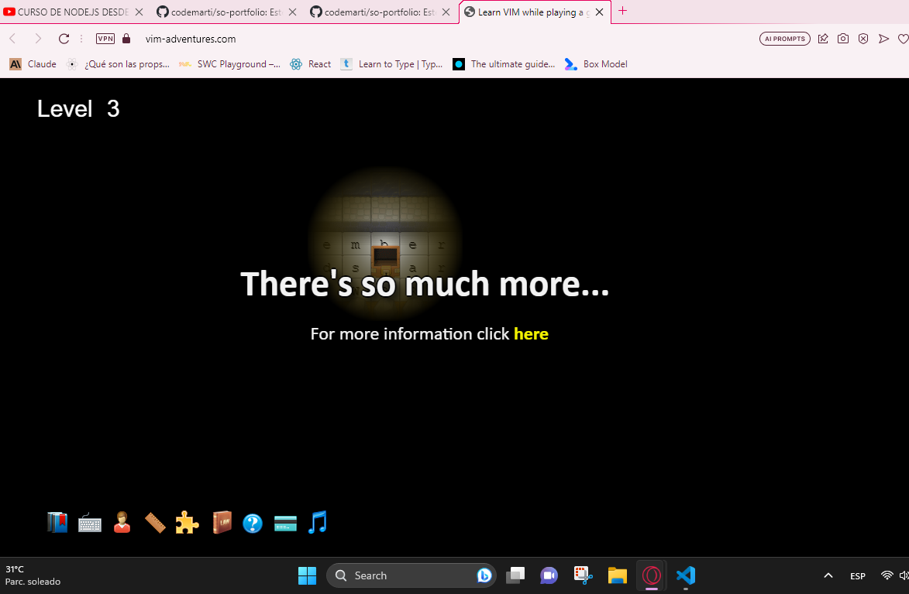

# SISTEMAS OPERATIVOS - PORTFOLIO
  
## Martín Martínez Arias - 27AV

#### Tarea #998
>`✅ Instalar Virtualbox y alguna distribucion de Linux, entregar para el 12/09/23, tomar screenshot del sistema ya instalado y subir la captura a su repositorio de tareas como evidencia.
>`
>
> 

----

#### Tarea #997
>`✅ Hacer el https://vim-adventures.com los niveles gratuitos, sacar un screenshot del ultimo nivel y subirlo a su repositorio de tareas para el 12/09/23 antes de clase.
>`
>
> 

----

#### Tarea #996
>`✅ Hacer un menú en bash que permita elegir la ejecución entre el script para crear un árbol de directorios, el script de hola mundo y el script de saludo usando variables y por último la opción de salir.
>`
>
> 

----

#### Tarea #995
>`✅ Crear un gif que explique algún concepto, relacionado al curso, que hayas aprendido.
>`
> 
